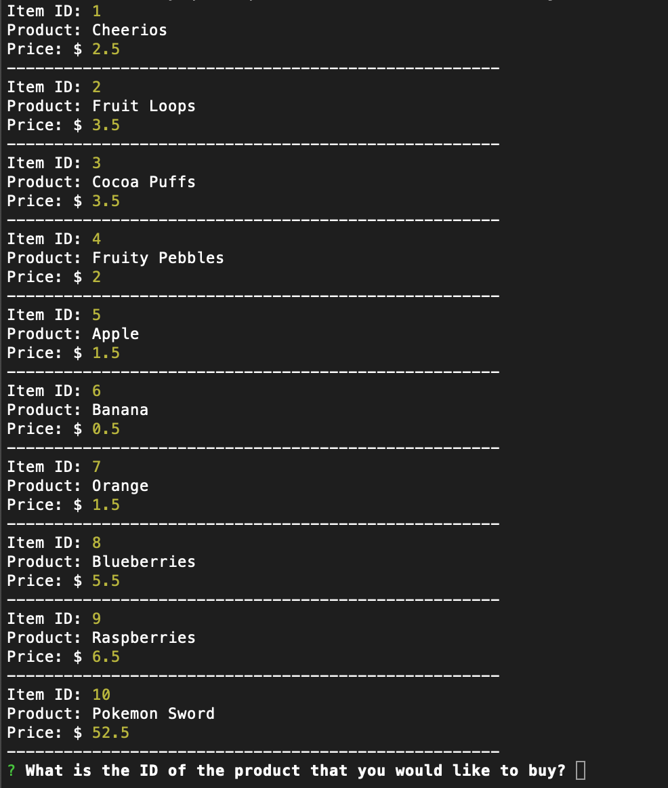
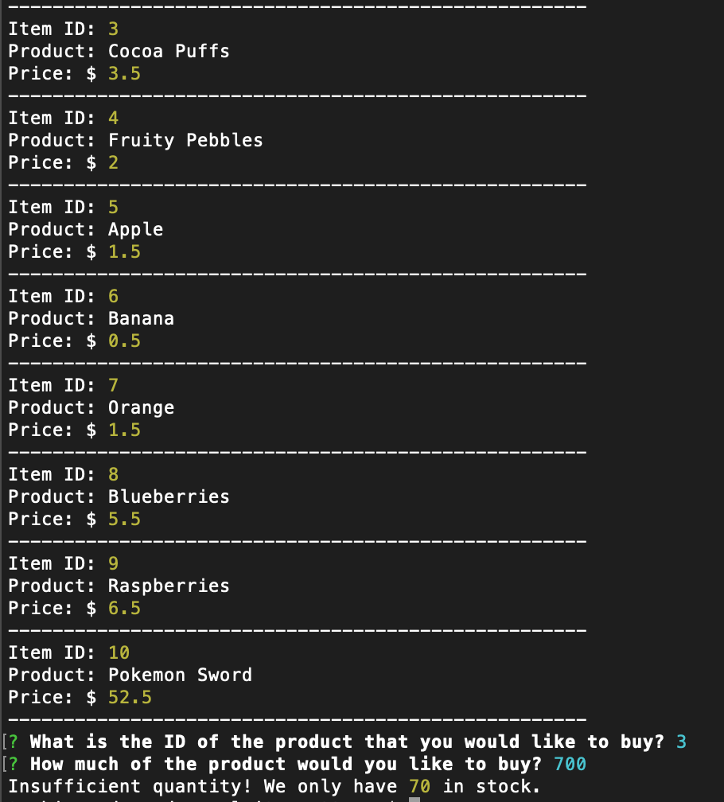
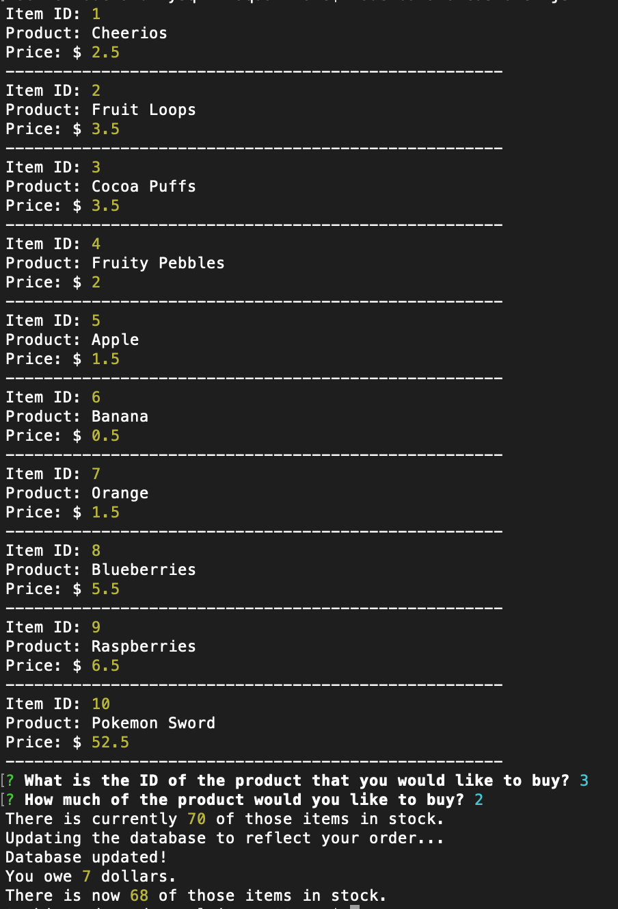

# node-and-mysql

## Instructions for the User

To run this project, download the repo and run ```node bamazonCustomer.js```. 

You might need to run ```npm i``` before this.

Once you run ```node bamazon Customer.js```, you should get a similar thing below. (Although you probably don't have the database, so maybe not ;))



Put in the ID of the product you would like to buy. I chose 3, Cocoa Puffs.

Put in how much you would like to buy. I'm going to put an outrageous amount to see what it does. Let's say, 700.

The terminal tells me there's only 70 in stock. Let's try that again!



I chose only 2 items. This time it works!
It says I owe 7 dollars, which is correct since each Cocoa Puffs is $3.50.

